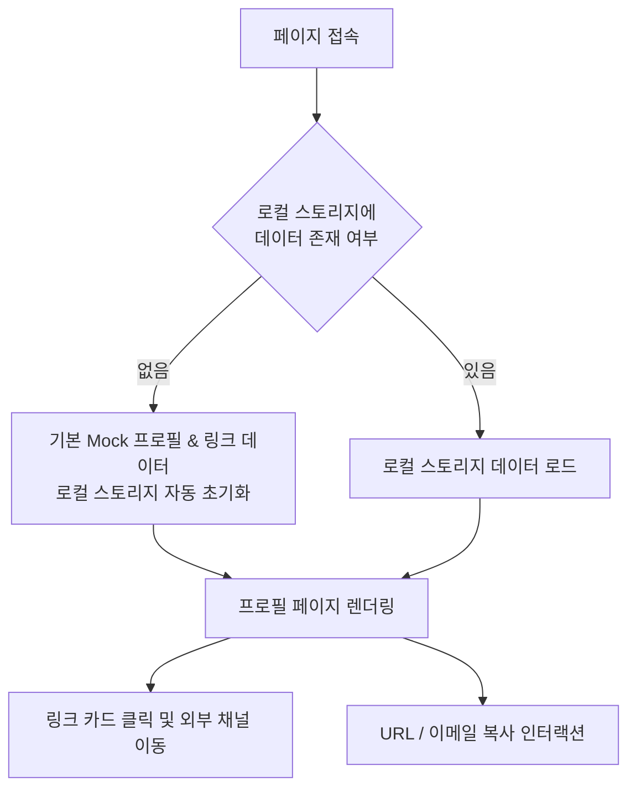

# 마이링크 (MyLink) - 제품 요구사항 정의서 (PRD)

> **버전**: v1.2.0 (Phase 1: LocalStorage 기반 프로필 페이지 전용)  
> **상태**: 승인됨 (Approved)  
> **작성일**: 2026-10-04  
> **대상 플랫폼**: Web (Mobile-First Responsive)  
> **현재 단계 범위**: **Phase 1 - 로컬 스토리지 연동 프로필 페이지** (대시보드, 인증, 통계 기능은 후속 단계로 유보)

---

## 1. 프로젝트 개요 (Executive Summary)

### 1.1 제품 정의
**마이링크(MyLink)**는 사용자의 다양한 채널과 링크(포트폴리오, SNS, 블로그, 이력서 등)를 한눈에 볼 수 있는 깔끔하고 세련된 **링크 인 바이오(Link-in-bio) 웹 애플리케이션**입니다.

단계적 출시 전략에 따라, **1단계(Phase 1)**에서는 대시보드 관리자나 복잡한 통계/인증 기능 없이 **브라우저 `localStorage`를 단일 데이터 소스로 활용하여 빠르고 유려하게 동작하는 '프로필 페이지' 완성에 집중**합니다.

### 1.2 개발 원칙 및 범위 정의
- **Phase 1 핵심 목표**: 로컬 스토리지의 프로필/링크 데이터를 기반으로 렌더링되는 모바일 퍼스트 프로필 페이지 완성
- **단계적 제외 항목 (Phase 2 이후 개발)**:
  - ❌ 회원가입 / 로그인 / 인증 시스템
  - ❌ 별도의 관리자 대시보드 에디터 (`/admin`)
  - ❌ 방문자수 및 클릭수 통계 차트 (Analytics)
  - ❌ 외부 백엔드 서버 및 원격 데이터베이스
- **로컬 스토리지 활용 방식**:
  - 첫 방문 시 완성도 높은 기본 Mock 프로필 & 링크 데이터 자동 시딩 (Initial Seed)
  - 로컬 스토리지의 데이터를 읽어 프로필 헤더, 소셜 아이콘, 링크 카드, 기술 스택 등을 동적 렌더링
  - 클라이언트 사이드 영속성(Persistence) 확보

---

## 2. 사용자 페르소나 및 상세 시나리오 (Phase 1)

### 2.1 주요 페르소나 정의

| 구분 | 페르소나 1: 테크 리크루터 | 페르소나 2: SNS 팔로워 / 잠재 고객 | 페르소나 3: 프로필 소유자 (크리에이터/개발자) |
| :--- | :--- | :--- | :--- |
| **이름/역할** | **박수현 (34세, IT 기업 채용 담당자)** | **이지은 (25세, 인스타그램 팔로워)** | **홍길동 (28세, 프론트엔드 개발자)** |
| **접속 환경** | 데스크톱(Chrome/macOS) 및 모바일(iOS Safari) | 인스타그램/트위터 인앱 브라우저 (iOS/Android) | 모바일 및 데스크톱 (개인 작업 브라우저) |
| **핵심 목표** | 지원자의 역량, 포트폴리오, 소스코드, 평소 기술 학습 태도를 1분 내 신속 검토 | 크리에이터의 추천 프로젝트, 최신 콘텐츠 및 SNS 채널로 이탈 없이 탐색 | 자신의 전문성과 작업물을 토스 감성의 세련된 단일 링크로 깔끔하게 브랜딩 |
| **주요 고통점** | 링크가 여러 곳에 흩어져 있거나, 페이지 로딩이 느리고 모바일 뷰가 깨져 답답함 | 링크 클릭 시 로딩이 길거나 광고/불필요한 팝업으로 이탈 발생 | 거추장스러운 설정이나 백엔드 구축 없이 빠르고 완성도 높은 링크 페이지 필요 |

---

### 2.2 상세 사용자 시나리오 (End-to-End User Scenarios)

#### 시나리오 A: 채용 담당자의 신속한 지원자 검증 흐름
> **상황**: 박수현 님은 서류 지원서에 기재된 홍길동 지원자의 마이링크 URL(`mylink.io/@gildong`)을 클릭합니다.
1. **즉각적인 로딩 (Fast Loading)**:
   - 0.5초 이내에 부드러운 애니메이션과 함께 프로필 화면이 로드됩니다.
2. **첫인상 및 요약 정보 파악 (Hero Card)**:
   - 상단 히어로 카드에서 지원자의 아바타, 이름("홍길동"), 현재 포지션("Frontend Developer"), 핵심 가치관이 담긴 한 줄 소개를 즉시 읽습니다.
   - 직무 태그 칩(`React 19`, `Next.js 16`, `TypeScript`, `Tailwind CSS v4`)을 통해 지원자가 다루는 최신 기술 스택을 한눈에 식별합니다.
3. **핵심 작업물 탐색 (Link Cards)**:
   - `[추천]` 뱃지가 달린 최상단 **"포트폴리오"** 카드를 클릭하여 배포된 프로젝트들을 새 탭에서 확인합니다.
   - 뒤이어 **"GitHub"** 및 **"기술 블로그"** 카드를 차례로 클릭해 오픈소스 기여 내역과 평소 기술 글쓰기 깊이를 검토합니다.
4. **빠른 컨택 (Quick Contact Action)**:
   - 검토 결과가 만족스러워 상단 빠른 액션 바의 **"이메일 복사"** 버튼을 클릭합니다.
   - 화면 하단에 `"이메일 주소를 복사했어요"`라는 토스트 메시지가 부드럽게 나타나며, 박 님은 메일 프로그램에 주소를 붙여넣고 면접 제안을 보냅니다.
5. **결과 및 만족도**:
   - 흩어져 있던 산발적 링크들을 찾느라 시간을 낭비하지 않고 2분 만에 지원자 검토를 완료하였으며, 세련되고 잘 정돈된 페이지 구성으로 지원자에 대한 호감도가 대폭 상승합니다.

---

#### 시나리오 B: SNS 방문자의 콘텐츠 및 외부 채널 탐색 흐름
> **상황**: 이지은 님은 SNS(인스타그램 바이오)에 게시된 링크를 인앱 브라우저를 통해 터치하여 접속합니다.
1. **모바일 최적화 뷰 경험**:
   - 인앱 브라우저 상·하단 내비게이션 바가 있는 좁은 뷰포트에서도 여백이 깨지지 않고 완벽한 모바일 단일 컬럼(최대 520px)으로 렌더링됩니다.
2. **직관적인 비주얼 터치 인터랙션**:
   - 카드 터치 시 토스 디자인 시스템 특유의 살짝 눌리는 탭 피드백(`active:scale-[0.98]`)을 느끼며 경쾌하게 링크를 탐색합니다.
   - 하단 소셜 아이콘 바에서 다른 플랫폼(블로그, 깃허브 등)을 확인하고 자연스럽게 추가 구독으로 이어집니다.
3. **링크 공유 및 전파**:
   - 상단 우측의 **"공유하기"** 버튼을 누르자 클립보드에 링크가 복사되며 토스트 알림이 뜹니다.
   - 지은 님은 친구와의 단체 메신저 방에 해당 링크를 붙여넣어 "이 개발자 링크인바이오 페이지 정말 깔끔하다"며 공유합니다.

---

#### 시나리오 C: 프로필 소유자의 첫 접속 및 로컬 영속성 확인 흐름
> **상황**: 홍길동 님은 별도의 데이터베이스 구축 없이 로컬 스토리지 기반으로 동작하는 마이링크를 처음 브라우저로 엽니다.
1. **자동 초기 시딩 (Zero Configuration)**:
   - 브라우저에 접속하자마자 `localStorage`에 데이터가 없는 것을 감지하고, 비어있는 화면 대신 완성도 높은 기본 Mock 데이터가 자동으로 주입됩니다.
   - 실제 완성형 페이지의 모습을 즉시 확인하며 디자인 완성도를 체감합니다.
2. **클라이언트 영속성(Persistence) 검증**:
   - 브라우저를 강력 새로고침(Ctrl + Shift + R)하거나 브라우저 탭을 닫았다가 다시 열어도 데이터가 증발하지 않고 로컬 스토리지로부터 즉각 안전하게 복원됨을 확인합니다.
3. **향후 확장성 체감**:
   - 로컬 데이터 구조가 잘 정의되어 있어, 향후 Phase 2(편집 모달) 및 Phase 3(대시보드)이 추가되더라도 데이터 유실 없이 매끄럽게 연결될 수 있음을 확신합니다.

---

### 2.3 예외 및 엣지 케이스 시나리오 (Edge Cases)

| 예외 상황 | 잠재 위험 요소 | 시스템 대응 및 해결 방안 |
| :--- | :--- | :--- |
| **초기 로컬 스토리지 비어있음** | 빈 화면이나 `null` 참조로 인한 런타임 크래시 | 앱 마운트 즉시 `DATA-01(Auto Seed)` 로직이 발동하여 기본 Mock 프로필 데이터를 채워넣고 렌더링 |
| **Next.js Hydration 불일치** | 서버 HTML과 브라우저 로컬스토리지 값 불일치로 인한 화면 깜빡임/에러 | 마운트 완료 전까지 스켈레톤(Skeleton UI) 또는 부드러운 플레이스홀더를 렌더링하고, 클라이언트 마운트 후 안전하게 전환 |
| **비정상적이거나 긴 텍스트 입력** | 소개글이나 링크 제목이 길어서 카드 레이아웃이 찌그러짐 | 텍스트 영역에 자동 줄바꿈(`break-words`) 및 적절한 최대 라인수(`line-clamp`) 처리로 디자인 규격 유지 |
| **오프라인 / 불안정한 네트워크** | 외부 서버 단절 시 페이지 로딩 실패 | 모든 프로필/링크 데이터가 클라이언트 `localStorage`에 상주하므로 오프라인 상태에서도 100% 즉시 표시 가능 |
| **클립보드 API 권한 미지원 브라우저** | `navigator.clipboard` 사용 불가 시 복사 실패 | Fallback 메커니즘(`document.execCommand('copy')` 또는 프롬프트 안내)을 마련하여 복사 실패 방지 |

---

## 3. 핵심 사용자 여정 (User Journey - Phase 1)



---

## 4. 화면 구성 와이어프레임 (Wireframe)

### 4.1 메인 화면 — 방문자 뷰 (`/` 또는 `/{username}`)

> 모바일 기준(390px), 상단에서 하단으로 스크롤되는 단일 컬럼 구조입니다.

```
┌──────────────────────────────────────┐  ← max-w-lg (520px 중앙 정렬)
│                                      │
│ ┌────────────────────────────────┐   │
│ │  [PAGE-02] 상단 고정 앱 바     │   │  ← sticky top-0, h-56px
│ │  홍길동                  [공유] │   │     backdrop-blur, border-bottom
│ └────────────────────────────────┘   │
│                                      │
│ ┌────────────────────────────────┐   │
│ │  [PAGE-03] 프로필 히어로 카드  │   │  ← rounded-[24px], bg-white
│ │                                │   │
│ │   ╭────╮  홍길동  [Verified]   │   │     아바타: 64x64px, 이니셜 또는
│ │   │ 홍 │  Frontend Developer   │   │     프로필 이미지, 원형 border
│ │   ╰────╯                       │   │
│ │                                │   │
│ │  ╔══════════════════════════╗  │   │
│ │  ║ 사용자 중심의 경험과     ║  │   │     Bio 소개글 영역
│ │  ║ 인터랙션을 만드는        ║  │   │     bg-[#f9fafb], rounded-[16px]
│ │  ║ 프론트엔드 엔지니어입니다║  │   │
│ │  ╚══════════════════════════╝  │   │
│ └────────────────────────────────┘   │
│                                      │
│ ┌─────────────┐ ┌──────────────┐    │
│ │[PAGE-04]    │ │ [PAGE-04]    │    │  ← grid-cols-2, gap-2.5
│ │ ✉ 이메일 복사│ │ 📄 이력서 보기│    │     좌: 보조 버튼 (white border)
│ └─────────────┘ └──────────────┘    │     우: Primary CTA (blue bg)
│                                      │
│  Links ─────────────────────────    │  ← 섹션 레이블 (text-xs, muted)
│                                      │
│ ┌────────────────────────────────┐   │
│ │  [PAGE-05] 링크 카드 #1        │   │  ← rounded-[20px], bg-white
│ │  ┌──────┐                 [추천]│   │     hover: border-blue shadow
│ │  │  💼  │ 포트폴리오       〉  │   │     이모지: 40x40px rounded-[14px]
│ │  └──────┘ 주요 프로젝트 작업물 │   │     우측: 이동 화살표(›)
│ └────────────────────────────────┘   │
│                                      │
│ ┌────────────────────────────────┐   │
│ │  [PAGE-05] 링크 카드 #2        │   │
│ │  ┌──────┐                      │   │
│ │  │  🐙  │ GitHub           〉  │   │
│ │  └──────┘ 오픈소스 기여 기록   │   │
│ └────────────────────────────────┘   │
│                                      │
│ ┌────────────────────────────────┐   │
│ │  [PAGE-05] 링크 카드 #3        │   │
│ │  ┌──────┐                      │   │
│ │  │  ✍️  │ 기술 블로그      〉  │   │
│ │  └──────┘ 프론트엔드 이야기    │   │
│ └────────────────────────────────┘   │
│                                      │
│ ┌────────────────────────────────┐   │
│ │  [PAGE-06] Tech Stacks         │   │  ← rounded-[24px], bg-white
│ │                                │   │
│ │  [React 19] [Next.js 16]       │   │     칩: rounded-full, bg-[#f2f4f6]
│ │  [TypeScript] [Tailwind v4]    │   │     flex-wrap, gap-1.5
│ │  [UI/UX]                       │   │
│ └────────────────────────────────┘   │
│                                      │
│         [PAGE-07] 소셜 아이콘 바      │
│          ⊙GitHub  ⊙Blog  ⊙X         │  ← 원형 아이콘 버튼 (40x40px)
│                                      │
│    [PAGE-08] Powered by MyLink       │  ← text-xs, muted, centered
│                                      │
└──────────────────────────────────────┘
```

### 4.2 인터랙션 행동 명세

| 컴포넌트 | 사용자 액션 | 결과 동작 |
| :--- | :--- | :--- |
| **[공유] 버튼** | 탭/클릭 | 현재 URL을 클립보드에 복사 → 하단 토스트 "링크를 복사했어요" 2.4초 표시 |
| **[이메일 복사] 버튼** | 탭/클릭 | 이메일 주소를 클립보드에 복사 → 토스트 "이메일 주소를 복사했어요" 2.4초 표시 |
| **[이력서 보기] 버튼** | 탭/클릭 | 이력서 URL로 새 탭(`target="_blank"`) 이동 |
| **링크 카드** | 탭/클릭 | `active:scale-[0.98]` 누름 피드백 후 해당 URL 새 탭 이동 |
| **링크 카드** | 호버 (데스크톱) | `border-blue` + 그림자 강조, 이모지 아이콘 `scale-110`, 화살표 blue 전환 |
| **소셜 아이콘 버튼** | 탭/클릭 | 해당 소셜 채널 URL 새 탭 이동 |

### 4.3 토스트 알림 사양

```
              (화면 하단 중앙 플로팅)
    ╭────────────────────────────────╮
    │   ✓  링크를 복사했어요         │  ← rounded-full
    ╰────────────────────────────────╯   bg-[#191f28]/95, text-white
         ↑ 2.4초 후 페이드아웃          backdrop-blur, shadow-lg
```

---

## 5. 기능 요구사항 명세 (Phase 1 Functional Requirements)

### 5.1 프로필 페이지 구조 및 컴포넌트
| ID | 기능명 | 상세 내용 | 우선순위 |
| :--- | :--- | :--- | :--- |
| **PAGE-01** | 모바일 퍼스트 레이아웃 | 최대 너비 520px(max-w-lg) 중심의 반응형 모바일 뷰, 데스크톱 접속 시 중앙 정렬 배치 | P0 (Must) |
| **PAGE-02** | 상단 앱 바 (Header) | 고정형 헤더, 사용자 닉네임 표시, 우측 '공유하기(링크 복사)' 버튼 및 토스트 피드백 | P0 (Must) |
| **PAGE-03** | 프로필 히어로 카드 | 원형 아바타(이미지 또는 이니셜), 표시 이름, 직무/역할 태그, 한 줄 소개글 노출 | P0 (Must) |
| **PAGE-04** | 빠른 액션 버튼 바 | '이메일 복사', '이력서 다운로드/보기' 등 핵심 행동 즉시 실행 버튼 및 토스트 알림 | P0 (Must) |
| **PAGE-05** | 주요 링크 카드 리스트 | 로컬 스토리지에 저장된 링크 목록을 카드 형태로 순서대로 렌더링<br/>- 좌측 이모지/아이콘, 제목, 부제(설명), 우측 화살표<br/>- 필요 시 강조 뱃지(예: '추천', 'NEW') 표시 | P0 (Must) |
| **PAGE-06** | 기술 스택 / 태그 칩 | 프로필 소유자의 관심사 또는 기술 스택 칩(React, Next.js, TypeScript 등) 표시 | P0 (Must) |
| **PAGE-07** | 소셜 아이콘 바 | 하단 GitHub, Blog, X, LinkedIn 등 소셜 채널 바로가기 아이콘 모음 | P0 (Must) |
| **PAGE-08** | 바텀 푸터 | 브랜드 카피라이트("Powered by MyLink") 및 미니멀 푸터 | P0 (Must) |

### 5.2 로컬 스토리지 연동 및 데이터 관리
| ID | 기능명 | 상세 내용 | 우선순위 |
| :--- | :--- | :--- | :--- |
| **DATA-01** | 자동 시딩 (Auto Seed) | `localStorage`에 데이터가 없을 경우 기본 Mock 데이터를 자동 생성하여 저장 | P0 (Must) |
| **DATA-02** | 데이터 동기화 Hook | React Custom Hook(`useProfileStorage`)을 통해 로컬 스토리지 상태를 안전하게 읽고 구독 | P0 (Must) |
| **DATA-03** | SSR Hydration 오류 방지 | 클라이언트 마운트 이후 로컬 스토리지를 읽어 Next.js Hydration 불일치 오류 방지 (Skeleton/Loading 처리) | P0 (Must) |

---

## 6. 데이터 모델 및 LocalStorage 스키마

### 6.1 LocalStorage Key
- `mylink_profile_data`: 프로필 정보와 링크 목록이 포함된 단일 통합 JSON 객체

### 6.2 TypeScript 인터페이스 정의
```typescript
export interface LinkItem {
  id: string;              // 고유 ID
  title: string;           // 링크 제목 (예: "포트폴리오")
  subtitle: string;        // 보조 설명 (예: "진행했던 주요 프로젝트와 작업물이에요")
  url: string;             // 목적지 URL
  icon: string;            // 이모지 또는 아이콘명 (💼, 🐙, ✍️, 📄 등)
  badge?: string;          // 강조 뱃지 (선택, 예: "추천")
  isActive: boolean;       // 노출 여부
}

export interface SocialLink {
  platform: "github" | "blog" | "email" | "instagram" | "twitter";
  url: string;
}

export interface ProfileData {
  displayName: string;     // 표시 이름 (예: "홍길동")
  role: string;            // 직무/역할 (예: "Frontend Developer")
  bio: string;             // 소개글 (예: "사용자 중심의 가치를 만드는 엔지니어입니다.")
  avatarText?: string;     // 텍스트 아바타 (예: "홍")
  avatarUrl?: string;      // 이미지 아바타 URL
  email: string;           // 빠른 복사용 이메일
  stacks: string[];        // 기술 스택/태그 목록
  links: LinkItem[];       // 주요 링크 목록
  socials: SocialLink[];   // 하단 소셜 링크 목록
}
```

### 6.3 기본 시드 Mock 데이터 구조
```json
{
  "displayName": "홍길동",
  "role": "Frontend Developer",
  "bio": "사용자 중심의 경험과 인터랙션을 만드는 프론트엔드 엔지니어입니다.",
  "avatarText": "홍",
  "email": "gildong@example.com",
  "stacks": ["React 19", "Next.js 16", "TypeScript", "Tailwind CSS v4"],
  "links": [
    {
      "id": "portfolio",
      "title": "포트폴리오",
      "subtitle": "진행했던 주요 프로젝트와 작업물이에요",
      "badge": "추천",
      "url": "https://github.com",
      "icon": "💼",
      "isActive": true
    },
    {
      "id": "github",
      "title": "GitHub",
      "subtitle": "오픈소스 기여와 개발 기록을 볼 수 있어요",
      "url": "https://github.com",
      "icon": "🐙",
      "isActive": true
    },
    {
      "id": "blog",
      "title": "기술 블로그",
      "subtitle": "웹 성능 최적화와 프론트엔드 이야기를 써요",
      "url": "https://velog.io",
      "icon": "✍️",
      "isActive": true
    },
    {
      "id": "resume",
      "title": "이력서",
      "subtitle": "상세한 기술 스택과 경력 사항이에요",
      "url": "#resume",
      "icon": "📄",
      "isActive": true
    }
  ],
  "socials": [
    { "platform": "github", "url": "https://github.com" },
    { "platform": "blog", "url": "https://velog.io" }
  ]
}
```

---

## 7. 디자인 및 UI 사양 (Toss Design System 스타일)

- **배경색**: `#F9FAFB` (부드러운 오프화이트 서피스)
- **카드 서피스**: `#FFFFFF`, `border: #E5E8EB`, 라운드 코너 `rounded-[24px]`
- **타이포그래피**: Pretendard Variable 폰트, 가독성 높은 폰트 위계
- **포인트 색상**: Toss Blue (`#3182F6`)
- **텍스트 컬러**: Primary `#191F28`, Secondary `#4E5968`, Tertiary `#8B95A1`
- **인터랙션**:
  - 카드 호버 및 클릭 시 살짝 눌리는 애니메이션 (`active:scale-[0.98] transition-transform`)
  - 토스트 알림 (하단 플로팅, 2.4초 후 자동 페이드아웃)

---

## 8. 전체 단계별 로드맵 (Phased Roadmap)

| 단계 | 명칭 | 주요 구현 범위 | 상태 |
| :--- | :--- | :--- | :--- |
| **Phase 1** | **LocalStorage 프로필 페이지** | **로컬 스토리지 시딩 + 모던 프로필 페이지 뷰 완성 (현재 목표)** | **진행 준비** |
| **Phase 2** | 링크 인라인/모달 편집기 | 프로필 페이지 내에서 직접 링크를 추가/수정/삭제하는 간이 편집 모드 | 다음 단계 |
| **Phase 3** | 관리자 대시보드 & 테마 | 좌측 에디터 + 우측 실시간 폰 프리뷰 스플릿 뷰 및 테마 변경 | 후속 단계 |
| **Phase 4** | 통계 및 방문 분석 | 조회수/클릭수 로깅 및 주간/월간 추이 차트 | 후속 단계 |
| **Phase 5** | 회원가입 및 멀티유저 전환 | 실제 Auth 및 백엔드 DB 연동을 통한 멀티유저 SaaS 전환 | 장기 과제 |

---

## 9. 비기능적 요구사항 (Non-Functional Requirements)

1. **Hydration 완벽 대응**: 로컬 스토리지 접근으로 인한 Next.js 클라이언트/서버 렌더링 불일치(Hydration Mismatch)가 발생하지 않도록 초기 마운트 상태 제어.
2. **반응형 최적화**: 모바일(320px~480px), 태블릿, 데스크톱 모든 환경에서 깨짐 없는 중앙 정렬 레이아웃 유지.
3. **접근성(A11y)**: 링크 및 버튼에 직관적인 `aria-label` 및 키보드 포커스 링 스타일 지원.

